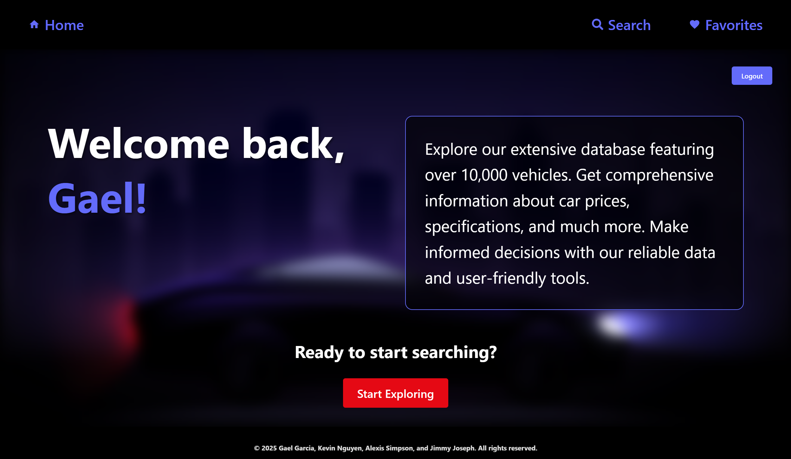
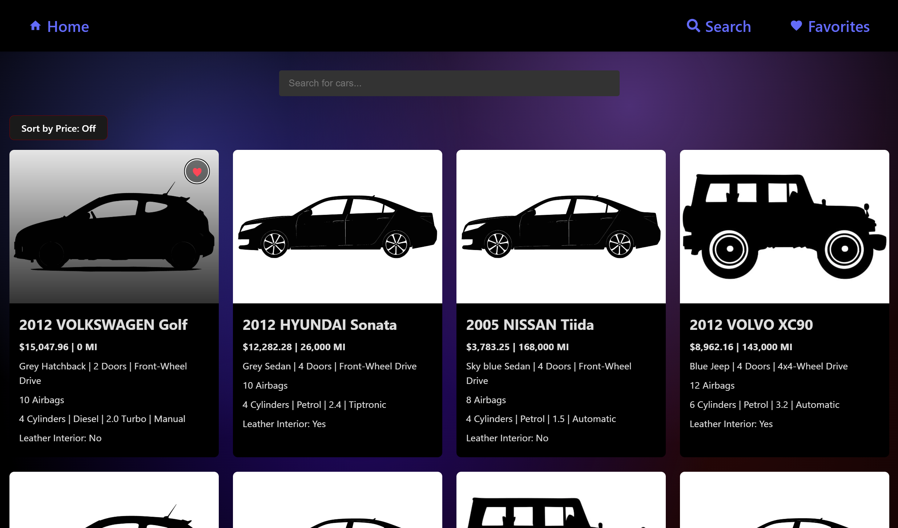
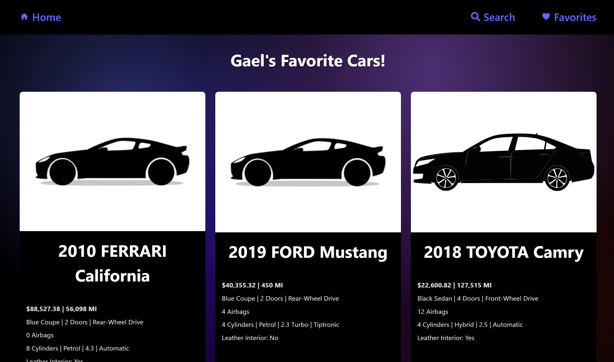

# **CAR COST**

_Empowering seamless connections for smarter user experiences._

<div align="center">


</div>

---

### Built with the tools and technologies:

<p align="center">
  
  
  
  
  
  
  
  
  
  
  
</p>

---

## 📚 Table of Contents

- [Overview](#overview)
- [Getting Started](#getting-started)
  - [Prerequisites](#prerequisites)
  - [Installation](#installation)
  - [Usage](#usage)
- [Deployed Site](#live-demo)
- [Technologies Used](#technologies-used)
- [Screenshots](#screenshots)
- [Contributors](#contributors)

---

## 📖 Overview

**Car Cost** is a web application that helps users explore and compare car prices with ease. Built using modern web technologies, it offers a smooth user experience and features like car search, price sorting, and the ability to save favorites. The project is designed with both functionality and performance in mind, making it a reliable tool for anyone looking to make informed car-buying decisions.

---

## 🚀 Getting Started

Follow these steps to get a local copy up and running:

### ✅ Prerequisites

- [Node.js](https://nodejs.org/)
- [npm](https://www.npmjs.com/)
- A code editor like [VS Code](https://code.visualstudio.com/)

---

### 🛠️ Installation

Build the project from source and install dependencies:

1. **Clone the repository:**

   ```bash
   git clone https://github.com/jimmy-joseph/CEN_Group_7_Project
   ```

2. **Navigate to the project directory:**

   ```bash
   cd CEN_Group_7_Project
   ```

3. **Install dependencies:**

   ```bash
   npm install
   ```

---

### 📂 Usage

Run the development server:

```bash
npm run dev
```

Your app will typically be served at `http://localhost:5173` (or whichever port Vite configures).

---

## 🌍 Live Demo

Experience the live app here:

👉 [https://carcost.vercel.app/](https://carcost.vercel.app/)

---

## 📸 Screenshots


_Firebase authentication login screen_


_Main Home page view_


_Search page view_


_Favorites page view_

---

## 👨‍💻 Contributors

| Name           | GitHub                                             | Role               |
| -------------- | -------------------------------------------------- | ------------------ |
| Jimmy Joseph   | [@jimmy-joseph](https://github.com/jimmy-joseph)   | Lead Developer     |
| Gael Garcia    | [@GG1627](https://github.com/GG1627)               | Frontend Developer |
| Kevin Nguyen   | [@nguyenkevin3](https://github.com/nguyenkevin3)   | Frontend Developer |
| Alexis Simpson | [@alexissimpson](https://github.com/alexissimpson) | Frontend Developer |

---
